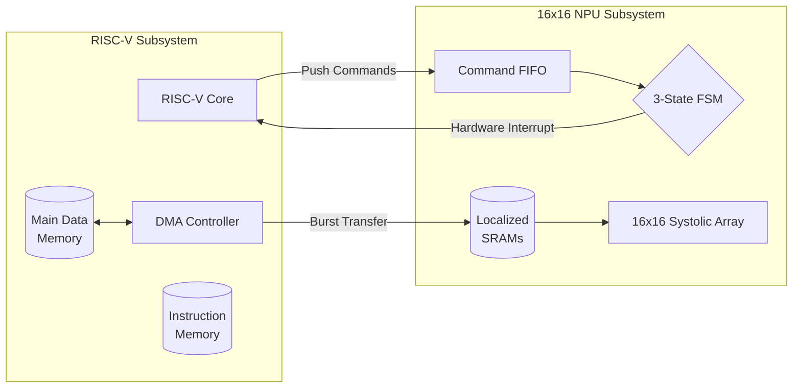

<h1 align="center">NeuroCore SoC</h1>

<p align="center">
  
  
  
  
  
  
</p>

---

## A-Z System Architecture

**NeuroCore** is a high-performance System-on-Chip (SoC) that physically merges a custom RISC-V processor with a massively parallel, memory-mapped Neural Processing Unit (NPU).

### 1. The 16x16 NPU Subsystem
At the physical core of NeuroCore is a tightly-coupled **16x16 Systolic Array NPU**. 
* **Seamless Scalability:** By leveraging the NPU's universal parameterized logic, the physical matrix is instantiated at a `16x16` hardware scale.
* **Autonomous Execution:** The NPU abstracts all physical pipeline timing via a highly optimized 3-State Finite State Machine (IDLE, LOAD_WEIGHT, RUN_MAC). This controller completely automates matrix dot-product orchestration without stalling the CPU.
* **Native Post-Processing:** The 16x16 subsystem natively processes Bias Addition (A*B + C), Hardware ReLU non-linear activation, 2x2 Max Pooling spatial downsampling, and Quantization Scaling directly within the hardware pipeline.

### 2. DMA Integration & Data Flow
NeuroCore completely avoids complex bus protocol wrappers internally by directly memory-mapping the NPU SRAM buffers into the RISC-V physical address space.
* **DMA Burst Streaming:** The RISC-V CPU configures the internal Direct Memory Access (DMA) controller to rapidly stream flattened input images (Activations) and convolutional kernels (Weights) from Main DRAM directly into the NPU's localized SRAM buffers.
* **Asynchronous Command Dispatch:** The CPU pushes a precise 32-bit execution command packet (specifying cycle bounds and post-processing toggles) into the NPU's asynchronous Command FIFO. The CPU is instantly released to perform other operations.
* **Hardware Interrupt:** Upon completion of the matrix block and post-processing, the FSM raises a hardware interrupt (`npu_ready`) back to the RISC-V processor, signaling that the output tensor is ready to be fetched from the OBUF.

---

## System Operation (How It Works)

Execution within the NeuroCore SoC requires synchronized operation between the RISC-V CPU, the DMA controller, and the NPU Subsystem. The execution pipeline follows this strict sequence:

1. **Compilation:** Standard C code is cross-compiled into bare-metal RISC-V instructions and loaded into the SoC Instruction Memory (`IMEM`).
2. **DMA Configuration:** The CPU initializes the DMA source and destination registers. The DMA performs burst transfers to route model parameters from Main Data Memory (`DMEM`) to the NPU's localized `IBUF`, `WBUF`, and `PBUF`.
3. **NPU Configuration:** The CPU modifies the NPU configuration register (`CFG`) at `0x50000000` to enable or bypass physical hardware features (e.g., toggling ReLU or 2x2 Pooling).
4. **Asynchronous Dispatch:** The CPU writes the operation payload into the NPU Command FIFO at `0xA0000000`.
5. **Execution & Yield:** The 16x16 Systolic Array executes the operations autonomously. Concurrently, the RISC-V CPU is released to process other non-blocking instructions.
6. **Interrupt Handling:** The NPU asserts the hardware interrupt. The CPU reads the processed output tensor directly from the `OBUF` memory offset.

---

## System Block Diagram



## Structural Address Mapping

The SoC utilizes a tightly coupled memory map to bridge the processor and accelerator:

| Peripheral | Base Address | Function |
| :--- | :--- | :--- |
| **DMEM** | `0x10000000` | Main CPU Data RAM |
| **IBUF** | `0x20000000` | NPU Input Activations |
| **WBUF** | `0x30000000` | NPU Matrix Weights |
| **OBUF** | `0x40000000` | NPU Final Processed Output |
| **CFG**  | `0x50000000` | NPU Post-Processing Settings |
| **DMA**  | `0x60000000` | DMA Controller Registers |
| **PBUF** | `0x70000000` | NPU Bias Preload Buffer |
| **FIFO** | `0xA0000000` | NPU Command Queue |

---

## SoC Simulation (How to Test)

The repository provides a complete end-to-end simulation environment. It instantiates the RISC-V core, executes the bare-metal C firmware payload, and validates output against assertions.

### Prerequisites
* RISC-V GNU Compiler Toolchain (`riscv64-unknown-elf-gcc`)
* Icarus Verilog (`iverilog`) or Verilator

### Execution
Navigate to the testbench directory to compile the C firmware and execute the simulation:
```bash
cd tb
make compile_fw
make sim
```

The hardware simulator will output success logs indicating that the NPU subsystem successfully completed the matrix math, passed ReLU negative thresholding, and accurately performed spatial pooling based on the firmware assertions.
