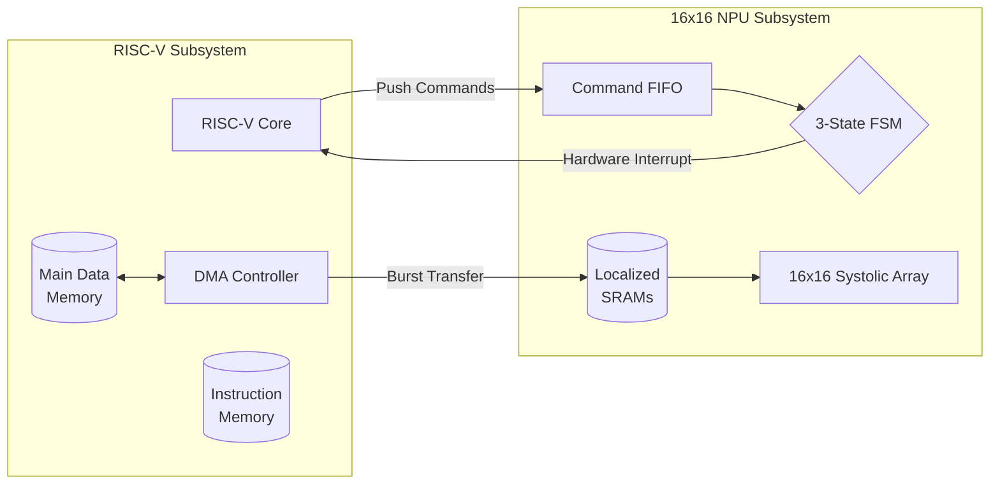

<h1 align="center">NeuroCore SoC</h1>

<p align="center">
  
  
  
  
  
</p>

---

## System Architecture

**NeuroCore** is a high-performance System-on-Chip (SoC) that physically merges a custom RISC-V processor with a massively parallel, memory-mapped Neural Processing Unit (NPU).



## Integration & Data Flow

By leveraging the NPU's universal parameterization, NeuroCore physically instantiates the compute matrix at a **16x16** scale. The design avoids complex bus protocol wrappers internally by directly memory-mapping the NPU SRAM buffers into the RISC-V physical address space.

### Execution Pipeline (Firmware Perspective)
The bare-metal C firmware orchestrates hardware acceleration autonomously, completely freeing the RISC-V CPU during matrix execution:

```c
// 1. DMA streams data from Main Memory to NPU SRAMs
dma_copy(WEIGHTS_ADDR, WBUF_BASE, 64);
dma_copy(ACTS_ADDR, IBUF_BASE, 64);

// 2. Configure Hardware Post-Processing (ReLU & 2x2 Max Pool)
*NPU_CFG = (1 << 5) | (1 << 6); 

// 3. Dispatch execution command to async FIFO
// Payload specifies accumulate logic and cycle counts
*NPU_CMD_FIFO = build_cmd(OP_RUN_MAC, payload);

// 4. CPU is free to execute other instructions!
// NPU raises hardware interrupt when complete.
```

## Structural Address Mapping

The SoC utilizes a tightly coupled memory map to bridge the processor and accelerator:

| Peripheral | Base Address | Function |
| :--- | :--- | :--- |
| **DMEM** | `0x10000000` | Main CPU Data RAM |
| **IBUF** | `0x20000000` | NPU Input Activations |
| **WBUF** | `0x30000000` | NPU Matrix Weights |
| **OBUF** | `0x40000000` | NPU Final Processed Output |
| **CFG**  | `0x50000000` | NPU Post-Processing Settings |
| **DMA**  | `0x60000000` | DMA Controller Registers |
| **PBUF** | `0x70000000` | NPU Bias Preload Buffer |
| **FIFO** | `0xA0000000` | NPU Command Queue |

## Verification Routine

The complete SoC verification suite simulates the RISC-V core executing compiled `firmware.c`. The firmware explicitly manages the DMA, triggers the NPU execution, and asserts that the hardware returns mathematically flawless results for 16x16 Matrix Multiplications, ReLU Negative Thresholding, and Spatial Pooling.
